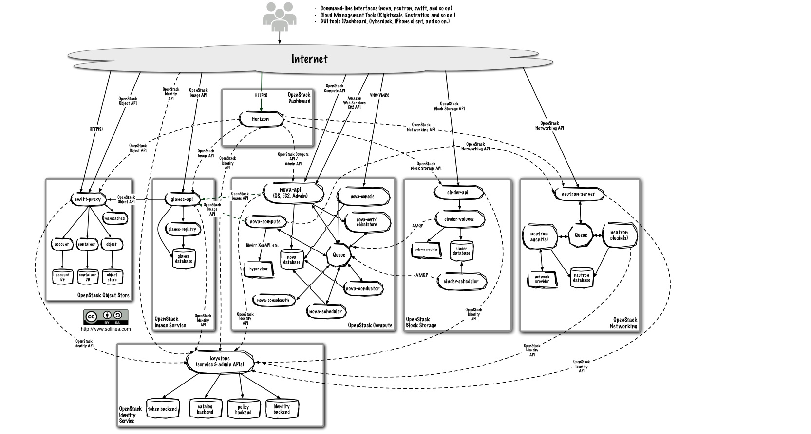

Logical architecture
=======================

要设计、部署和配置OpenStack，管理员必须理解它的逻辑架构。

OpenStack模块是下面的类型之一：

* Daemon： 后台进程，在linux上，一个daemon通常以服务的形式来安装。
* Script： 脚本，安装一个虚拟隔离环境并且运行单元测试，比如run_test.sh.
* Command-like interface(CLI)： 命令行，可以通过命令行的方式来调用OpenStack的API.

下图展示了最通用的OpenStack架构，但不仅于此：

图1.2 逻辑架构

